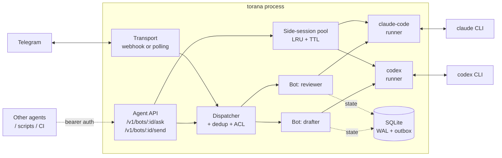

<div align="center">

# torana

**An open-source Telegram gateway for agent runtimes.**
Drop a YAML config, point it at Claude Code, Codex, or any subprocess — get a production-grade Telegram bot.

[](https://www.npmjs.com/package/torana)
[](https://github.com/jvbutterfield/torana/actions/workflows/ci.yml)
[](LICENSE)
[](https://bun.sh)
[](#testing)

**torana** (Sanskrit: तोरण, _ceremonial gateway_) — the doorway between Telegram and your agents.

</div>

---

## What you get

A single binary that runs one or more Telegram bots, each backed by whatever agent runtime you want. Webhook or polling. Streaming edits. Crash recovery. Dedup. Attachments. Slash commands. Graceful shutdown. Structured logs that redact secrets.

You write YAML. torana handles the rest.

```yaml
# torana.yaml — two bots, different runtimes, one process.
bots:
  - id: reviewer                        # code-review bot running Claude Code
    token: ${TELEGRAM_BOT_TOKEN_REVIEW}
    runner:
      type: claude-code
      env: { CLAUDE_CODE_OAUTH_TOKEN: ${CLAUDE_CODE_OAUTH_TOKEN} }

  - id: drafter                         # prose drafter running OpenAI Codex
    token: ${TELEGRAM_BOT_TOKEN_DRAFT}
    runner:
      type: codex
      approval_mode: full-auto
      env: { OPENAI_API_KEY: ${OPENAI_API_KEY} }
```

```sh
torana doctor --config torana.yaml   # catch misconfig before starting
torana start  --config torana.yaml   # done
```

---

## Why torana

**You're building a Telegram-facing agent** and you've hit one of these:

- Every example you found glues together `node-telegram-bot-api`, a database you don't want, and 400 lines of session/dedup/retry boilerplate — and it still loses messages on restart.
- You want different bots backed by different LLMs (Claude for code, Codex for writing, your own subprocess for niche tasks) but don't want to run three separate services.
- You've tried running `claude-code` or `codex` behind Telegram yourself and discovered the 15 edge cases: Telegram's 4096-char limit, edit-rate throttling, partial stream replies, mid-turn crashes, orphan attachments, webhook secret validation.
- You want a bot you can actually leave running — not a prototype.

torana is the infrastructure layer for that. It is **not** an agent, not a framework, not an SDK. It's the gateway that turns an agent CLI into a reliable Telegram service.

---

## 60-second quickstart

```sh
# 1. Install (Bun ≥ 1.3)
npm install -g torana

# 2. Get a bot token from @BotFather in Telegram. Note your Telegram user id.
export TELEGRAM_BOT_TOKEN=123456:ABCDEF...
export MY_TELEGRAM_USER_ID=111222333

# 3. Clone the echo example and run it — no agent API key required.
git clone https://github.com/jvbutterfield/torana.git
cd torana/examples/echo-bot
torana doctor --config torana.yaml
torana start  --config torana.yaml

# 4. Message your bot. It echoes back. You've proven the pipeline end-to-end.
```

Once echo works, swap the `runner:` block for `claude-code` or `codex` and you're live. See [`examples/echo-bot/`](examples/echo-bot/) and [`examples/codex-bot/`](examples/codex-bot/).

---

## Runners

Three runners ship built-in. Pick per bot.

| Runner            | Wraps                                                                                             | Use it when                                                                                       |
| ----------------- | ------------------------------------------------------------------------------------------------- | ------------------------------------------------------------------------------------------------- |
| **`claude-code`** | The `claude` CLI.                                                                                 | You want Anthropic's Claude with its full agentic tool-use, file edits, subagents. Best for code. |
| **`codex`**       | The OpenAI `codex` CLI (`codex exec --json`).                                                     | You want OpenAI's Codex with its sandbox/approval model. Best for writing and mixed tasks.        |
| **`command`**     | Any subprocess speaking a simple line protocol (`jsonl-text`, `claude-ndjson`, or `codex-jsonl`). | You're running your own model, a local Ollama setup, or a custom agent.                           |

Session continuity works everywhere: `--continue` for Claude Code, `codex exec resume <id>` for Codex, protocol-defined reset for `command`.

Full details: [`docs/runners.md`](docs/runners.md).

---

## Agent API (opt-in)

torana ships a bearer-authenticated HTTP surface that lets _other_ processes — other agents, scripts, cron jobs, CI — drive the bots that torana owns. Two modes:

- **`ask`** — synchronous request/response against a bot's runner in a **side-session** (an isolated subprocess with its own conversation context, separate from Telegram traffic). The gateway pools side-sessions with idle + hard TTLs, per-bot + global caps, and automatic LRU eviction.
- **`send`** — post a `[system-message from "<source>"]`-marker-wrapped message into an existing Telegram chat so the runner responds as if the user had typed it. Idempotent, ACL-re-checked.

Enable it per-config:

```yaml
agent_api:
  enabled: true
  tokens:
    - name: ci-reviewer
      secret_ref: ${TORANA_CI_TOKEN}
      bot_ids: ["reviewer"]
      scopes: ["ask", "send"]
```

Then call it from anywhere:

```sh
torana ask reviewer "what's wrong with this PR?" --server https://gw --token $TOK
torana send reviewer --user-id 111222333 "heads up: CI failed" --source ci
```

See [`docs/agent-api.md`](docs/agent-api.md) for the full protocol + [`docs/cli.md`](docs/cli.md) for every flag. Protected by SHA-256 hashed bearer tokens, `C009..C014` doctor checks, and the `R001..R003` remote-probe subset of `torana doctor --server URL --token TOK`.

---

## Architecture



One process. One SQLite database. Per-bot isolated runners. Crashes in one bot don't take down the others. Agent-API callers live beside Telegram traffic; the pool keeps their side-sessions off the main runner so a long ask from CI never blocks a Telegram reply.

---

## Operational guarantees

**Delivery.**

- Inbound `update_id` deduplicated in SQLite — safe to replay a webhook or resume polling after a crash.
- Outbound sends go through a **dead-letter outbox** with exponential backoff. A flaky Telegram response doesn't lose a reply.

**Crash recovery.**

- Runner state is a durable state machine in SQLite. A hard crash mid-turn resumes correctly on next start — no orphan "thinking..." messages, no double-sends.
- `torana doctor` runs pre-flight checks (C001–C008) so you find configuration problems before starting, not during your first real message.

**Streaming.**

- Runner output is streamed into Telegram message edits at a configurable cadence (default 1.5s), respecting Telegram's edit-rate ceiling and the 4096-char limit (with safe margin).
- Long replies auto-split across messages. No lost content.

**Safety defaults.**

- Default-deny ACL. An empty `allowed_user_ids` list rejects all traffic and logs a loud warning so you notice.
- Secret redaction. Bot tokens and webhook secrets are redacted from logs automatically, including from `/bot<TOKEN>/` URL paths.
- Attachment hardening. Mime-derived filename allowlist, disk cap, retention sweep. Files never escape the data directory.

**Observability.**

- Structured JSON logs, per-bot log files tailable at `<data_dir>/logs/<bot_id>.log`.
- `GET /health` with per-bot readiness, mailbox depth, last turn time. When the Agent API is enabled, `GET /v1/health` is also available.
- Optional Prometheus metrics. Agent-API counters, gauges, and request/acquire duration histograms are exported under `torana_agent_api_*` when `agent_api.enabled=true`.

---

## Hybrid configurations

Different bots, different runtimes, one process:

```yaml
version: 1
gateway: { port: ${PORT:-3000}, data_dir: ./data }
transport: { default_mode: polling }
access_control:
  allowed_user_ids: [${MY_TELEGRAM_USER_ID}]

bots:
  - id: reviewer
    token: ${TELEGRAM_BOT_TOKEN_REVIEWER}
    commands:
      - { trigger: /reset,  action: builtin:reset }
      - { trigger: /status, action: builtin:status }
    runner:
      type: claude-code
      cwd: /data/projects/reviewer
      env:
        CLAUDE_CODE_OAUTH_TOKEN: ${CLAUDE_CODE_OAUTH_TOKEN}

  - id: drafter
    token: ${TELEGRAM_BOT_TOKEN_DRAFTER}
    runner:
      type: codex
      approval_mode: full-auto
      sandbox: workspace-write
      env:
        OPENAI_API_KEY: ${OPENAI_API_KEY}

  - id: local
    token: ${TELEGRAM_BOT_TOKEN_LOCAL}
    runner:
      type: command
      protocol: jsonl-text
      cmd: ["bun", "./my-runner.ts"]
```

The dispatcher routes each update to its bot's runner independently. No special configuration required.

---

## Commands

| Command                                                                | What it does                                                                                                                                                      |
| ---------------------------------------------------------------------- | ----------------------------------------------------------------------------------------------------------------------------------------------------------------- |
| `torana start`                                                         | Run the gateway                                                                                                                                                   |
| `torana doctor`                                                        | Validate config + check Telegram + runner binary + DB state (C001..C014); with `--server/--token`, probes a remote gateway (R001..R003)                           |
| `torana validate`                                                      | Offline schema check — no Telegram, no DB                                                                                                                         |
| `torana migrate`                                                       | Apply pending DB migrations (`--dry-run` to preview)                                                                                                              |
| `torana version`                                                       | Print package version + Bun runtime                                                                                                                               |
| `torana ask` / `torana send` / `torana turns get` / `torana bots list` | Agent-API client commands (require `--server` + `--token`, or `TORANA_SERVER`/`TORANA_TOKEN`, or `--profile NAME`). See [`docs/cli.md`](docs/cli.md)              |
| `torana config`                                                        | Manage the CLI profile store (`init` / `add-profile` / `list-profiles` / `remove-profile` / `show`). Stored at `$XDG_CONFIG_HOME/torana/config.toml`, mode `0600` |
| `torana skills install --host=claude\|codex`                           | Copy the shipped `torana-ask` / `torana-send` skills into a Claude Code or Codex installation                                                                     |

---

## Environment inheritance

`runner.env` is the **complete** environment handed to the subprocess. Parent-process env vars are _not_ inherited by default (except `PATH`). To pass a variable, reference it via `${VAR}` interpolation:

```yaml
env:
  OPENAI_API_KEY: ${OPENAI_API_KEY} # inherited from torana's env
  HOME: ${HOME} # needed for OAuth-authenticated CLIs
  CUSTOM: literal-value # static
```

This is deliberate. It matches the explicit-env-passing ethos of reproducible deploys and avoids the classic "works locally, broken in prod" failure mode where the subprocess silently inherits a variable in one environment and not another.

---

## Non-goals (v1)

Explicit scope. torana does **not**:

- Handle group chats, voice, video, or inline mode.
- Implement its own agent logic — runners do that.
- Pluggable storage backends. SQLite only. WAL-mode, durable, operationally simple.

If you need any of those, torana is the wrong tool and that's fine.

---

## Status

**v1.0.0-rc.** Core transport, dispatch, streaming, and storage paths are stable and covered by 1142+ tests. Public config schema (`version: 1`) is frozen for v1 — any breaking change waits for `version: 2`.

Recent:

- **rc.5** — Agent API (`/v1/*` ask + send + side-session pool + CLI client + profile store + Claude Code skills + Codex plugin + Prometheus metrics + doctor C009..C014 + R001..R003). SQLite schema v2 migration — run `torana migrate` before first start.
- **rc.4** — Codex runner (`runner.type: codex`), `codex-jsonl` protocol for `command` runners, README rewrite
- **rc.3** — ACL warnings, PaaS port docs, docker-install smoke in CI
- **rc.2** — fixed published tarball missing migration SQL
- **rc.1** — initial v1 candidate

See [`CHANGELOG.md`](CHANGELOG.md) for the full history.

---

## Testing

```sh
bun test                           # unit + integration: 1142+ tests, ~60s
CODEX_E2E=1 bun test               # + end-to-end tests against the live codex CLI
AGENT_API_E2E=1 bun test test/e2e/agent-api/
                                   # + Agent-API E2E matrix against real claude / codex binaries
AGENT_API_SOAK=1 bun test test/soak/agent-api.test.ts
                                   # + 24h pool/memory/leak soak (default duration; overrideable)
```

The E2E and soak tests require authenticated `claude` / `codex` binaries and burn API quota, so they're opt-in. CI doesn't run them.

---

## Docs

- [`docs/configuration.md`](docs/configuration.md) — full config reference
- [`docs/runners.md`](docs/runners.md) — built-in runners, including Claude Code and Codex setup
- [`docs/transports.md`](docs/transports.md) — webhook vs polling
- [`docs/writing-a-runner.md`](docs/writing-a-runner.md) — build your own runner
- [`docs/security.md`](docs/security.md) — threat model, ACL, secrets
- [`docs/operations.md`](docs/operations.md) — logs, metrics, crash recovery, data dir layout
- [`docs/agent-api.md`](docs/agent-api.md) — Agent API overview (ask, send, side-sessions, tokens)
- [`docs/cli.md`](docs/cli.md) — CLI reference, flag-by-flag

---

## Contributing

Bug reports and feature requests in [Issues](https://github.com/jvbutterfield/torana/issues). PRs welcome — see [`CONTRIBUTING.md`](CONTRIBUTING.md). Security issues go through [`SECURITY.md`](SECURITY.md), not public issues.

## License

MIT — see [`LICENSE`](LICENSE).
