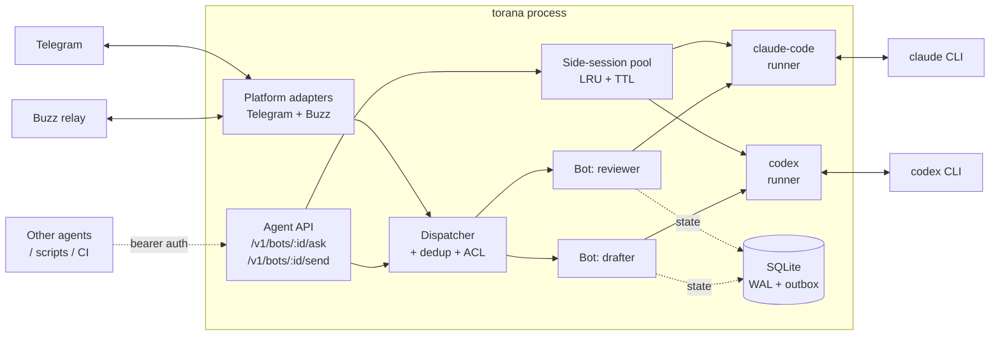

<div align="center">

# torana

**An open-source multi-platform gateway for agent runtimes.**
Connect Telegram and authenticated Buzz communities to Claude Code, Codex, or any compatible subprocess.

[](https://www.npmjs.com/package/torana)
[](https://github.com/jvbutterfield/torana/actions/workflows/ci.yml)
[](LICENSE)
[](https://bun.sh)
[](#testing)

**torana** (Sanskrit: तोरण, _ceremonial gateway_) — the doorway between your platforms and agents.

</div>

---

## What you get

A single binary that runs logical agents across Telegram and Buzz. Webhook,
polling, or authenticated relay. Signed delivery, streaming edits, crash
recovery, dedup, isolated conversation sessions, attachments, graceful
shutdown, and structured logs that redact secrets.

You write YAML. torana handles the rest.

```yaml
# torana.yaml — two bots, different runtimes, one process.
bots:
  - id: reviewer                        # code-review bot running Claude Code
    token: ${TELEGRAM_BOT_TOKEN_REVIEW}
    runner:
      type: claude-code
      env: { CLAUDE_CODE_OAUTH_TOKEN: ${CLAUDE_CODE_OAUTH_TOKEN} }

  - id: drafter                         # prose drafter running OpenAI Codex
    token: ${TELEGRAM_BOT_TOKEN_DRAFT}
    runner:
      type: codex
      approval_mode: full-auto
      env: { OPENAI_API_KEY: ${OPENAI_API_KEY} }
```

```sh
torana doctor --config torana.yaml   # catch misconfig before starting
torana start  --config torana.yaml   # done
```

---

## Why torana

**You're putting an agent into real conversations** and you've hit one of these:

- Every example you found glues together `node-telegram-bot-api`, a database you don't want, and 400 lines of session/dedup/retry boilerplate — and it still loses messages on restart.
- You want different bots backed by different LLMs (Claude for code, Codex for writing, your own subprocess for niche tasks) but don't want to run three separate services.
- You've tried running `claude-code` or `codex` behind Telegram yourself and discovered the 15 edge cases: Telegram's 4096-char limit, edit-rate throttling, partial stream replies, mid-turn crashes, orphan attachments, webhook secret validation.
- You want a bot you can actually leave running — not a prototype.

torana is the infrastructure layer for that. It is **not** an agent, not a framework, not an SDK. It turns an agent CLI into a reliable multi-platform service.

---

## 60-second quickstart

```sh
# 1. Install (Bun ≥ 1.3)
npm install -g torana

# 2. Get a bot token from @BotFather in Telegram. Note your Telegram user id.
export TELEGRAM_BOT_TOKEN=123456:ABCDEF...
export MY_TELEGRAM_USER_ID=111222333

# 3. Clone the echo example and run it — no agent API key required.
git clone https://github.com/jvbutterfield/torana.git
cd torana/examples/echo-bot
torana doctor --config torana.yaml
torana start  --config torana.yaml

# 4. Message your bot. It echoes back. You've proven the pipeline end-to-end.
```

Once echo works, swap the `runner:` block for `claude-code` or `codex` and you're live. See [`examples/echo-bot/`](examples/echo-bot/) and [`examples/codex-bot/`](examples/codex-bot/).

For Buzz, start with the disabled-by-default
[`examples/buzz-agent/`](examples/buzz-agent/) configuration. Operators with a
team should use [`examples/agent-team/`](examples/agent-team/) for the
master-switch → one-canary → full-team rollout.

---

## Runners

Three runners ship built-in. Pick per bot.

| Runner            | Wraps                                                                                             | Use it when                                                                                       |
| ----------------- | ------------------------------------------------------------------------------------------------- | ------------------------------------------------------------------------------------------------- |
| **`claude-code`** | The `claude` CLI.                                                                                 | You want Anthropic's Claude with its full agentic tool-use, file edits, subagents. Best for code. |
| **`codex`**       | The OpenAI `codex` CLI (`codex exec --json`).                                                     | You want OpenAI's Codex with its sandbox/approval model. Best for writing and mixed tasks.        |
| **`command`**     | Any subprocess speaking a simple line protocol (`jsonl-text`, `claude-ndjson`, or `codex-jsonl`). | You're running your own model, a local Ollama setup, or a custom agent.                           |

Session continuity works everywhere: `--continue` for Claude Code, `codex exec resume <id>` for Codex, protocol-defined reset for `command`.

Full details: [`docs/runners.md`](docs/runners.md).

---

## Agent API (opt-in)

torana ships a bearer-authenticated HTTP surface that lets _other_ processes — other agents, scripts, cron jobs, CI — drive the bots that torana owns. Two modes:

- **`ask`** — synchronous request/response against a bot's runner in a **side-session** (an isolated subprocess with its own conversation context, separate from Telegram traffic). The gateway pools side-sessions with idle + hard TTLs, per-bot + global caps, and automatic LRU eviction.
- **`send`** — post a `[system-message from "<source>"]`-marker-wrapped message into an existing Telegram chat so the runner responds as if the user had typed it. Idempotent, ACL-re-checked.

Enable it per-config:

```yaml
agent_api:
  enabled: true
  tokens:
    - name: ci-reviewer
      secret_ref: ${TORANA_CI_TOKEN}
      bot_ids: ["reviewer"]
      scopes: ["ask", "send"]
```

Then call it from anywhere:

```sh
torana ask reviewer "what's wrong with this PR?" --server https://gw --token $TOK
torana send reviewer --user-id 111222333 "heads up: CI failed" --source ci
```

See [`docs/agent-api.md`](docs/agent-api.md) for the full protocol + [`docs/cli.md`](docs/cli.md) for every flag. Protected by SHA-256 hashed bearer tokens, `C009..C014` doctor checks, and the `R001..R003` remote-probe subset of `torana doctor --server URL --token TOK`.

---

## Architecture


```mermaid
flowchart LR
    TG[Telegram]
    BZ[Buzz relay]
    AG[Other agents<br/>/ scripts / CI]
    subgraph torana[torana process]
      direction LR
      T[Platform adapters<br/>Telegram + Buzz]
      A[Agent API<br/>/v1/bots/:id/ask<br/>/v1/bots/:id/send]
      D[Dispatcher<br/>+ dedup + ACL]
      P[Side-session pool<br/>LRU + TTL]
      B1[Bot: reviewer]
      B2[Bot: drafter]
      R1[claude-code<br/>runner]
      R2[codex<br/>runner]
      DB[(SQLite<br/>WAL + outbox)]
      T --> D
      A --> D
      A --> P
      P --> R1
      P --> R2
      D --> B1 --> R1
      D --> B2 --> R2
      B1 -.state.-> DB
      B2 -.state.-> DB
    end
    TG <--> T
    BZ <--> T
    AG -. bearer auth .-> A
    R1 <--> CC[claude CLI]
    R2 <--> CX[codex CLI]
```

One process. One SQLite database. Per-agent runners and per-conversation
sessions. Telegram, Buzz, and Agent API traffic share the durable scheduler
without sharing context unless an explicit same-agent alias says they should.

---

## Operational guarantees

**Delivery.**

- Inbound Telegram `update_id` and signed Buzz event IDs are deduplicated in SQLite.
- Durable sends and mutations use a **dead-letter outbox**. Ambiguous Buzz
  retries reuse the exact stored signed event ID. A conversational reply is
  re-signed only when the relay explicitly rejects the old timestamp, proving
  that event was never accepted; publisher event identities remain immutable.
- Shutdown is two-phase: inbound intake closes first, then accepted turns and
  the outbox drain while outbound transports remain connected.

**Crash recovery.**

- Runner state is a durable state machine in SQLite. A hard crash mid-turn resumes correctly on next start — no orphan "thinking..." messages, no double-sends.
- `torana doctor` runs pre-flight checks (C001–C029) so you find configuration problems before starting, not during your first real message.

**Streaming.**

- Runner output is streamed into Telegram message edits at a configurable cadence (default 1.5s), respecting Telegram's edit-rate ceiling and the 4096-char limit (with safe margin).
- Long replies auto-split across messages. No lost content.

**Safety defaults.**

- Default-deny ACL. An empty `allowed_user_ids` list rejects all traffic and logs a loud warning so you notice.
- Secret redaction. Bot tokens and webhook secrets are redacted from logs automatically, including from `/bot<TOKEN>/` URL paths.
- Attachment hardening. Mime-derived filename allowlist, disk cap, retention sweep. Files never escape the data directory.
- **Runner subprocesses run unsandboxed in their `cwd` — torana does not jail them.** Run `claude-code` and `approval_mode: yolo` codex bots inside a container, VM, or dedicated UID; see [docs/security.md#runner-isolation](docs/security.md#runner-isolation) for concrete patterns.

**Observability.**

- Structured JSON logs, per-bot log files tailable at `<data_dir>/logs/<bot_id>.log`.
- `GET /health` with per-bot readiness, mailbox depth, last turn time. When the Agent API is enabled, `GET /v1/health` is also available.
- Optional Prometheus metrics. Agent-API counters, gauges, and request/acquire duration histograms are exported under `torana_agent_api_*` when `agent_api.enabled=true`.

---

## Hybrid configurations

Different bots, different runtimes, one process:

```yaml
version: 1
gateway: { port: ${PORT:-3000}, data_dir: ./data }
transport: { default_mode: polling }
access_control:
  allowed_user_ids: [${MY_TELEGRAM_USER_ID}]

bots:
  - id: reviewer
    token: ${TELEGRAM_BOT_TOKEN_REVIEWER}
    commands:
      - { trigger: /reset,  action: builtin:reset }
      - { trigger: /status, action: builtin:status }
    runner:
      type: claude-code
      cwd: /data/projects/reviewer
      env:
        CLAUDE_CODE_OAUTH_TOKEN: ${CLAUDE_CODE_OAUTH_TOKEN}

  - id: drafter
    token: ${TELEGRAM_BOT_TOKEN_DRAFTER}
    runner:
      type: codex
      approval_mode: full-auto
      sandbox: workspace-write
      env:
        OPENAI_API_KEY: ${OPENAI_API_KEY}

  - id: local
    token: ${TELEGRAM_BOT_TOKEN_LOCAL}
    runner:
      type: command
      protocol: jsonl-text
      cmd: ["bun", "./my-runner.ts"]
```

The dispatcher routes each update to its bot's runner independently. No special configuration required.

---

## Commands

| Command                                                                | What it does                                                                                                                                                                            |
| ---------------------------------------------------------------------- | --------------------------------------------------------------------------------------------------------------------------------------------------------------------------------------- |
| `torana start`                                                         | Run the gateway                                                                                                                                                                         |
| `torana doctor`                                                        | Validate config + check Telegram + runner binary + DB state (C001..C029); with `--server/--token`, probes a remote gateway (R001..R003)                                                 |
| `torana validate`                                                      | Offline schema check — no Telegram, no DB                                                                                                                                               |
| `torana migrate`                                                       | Apply pending DB migrations (`--dry-run` to preview; `--to 6` for explicit bridge activation)                                                                                           |
| `torana version`                                                       | Print package version + Bun runtime                                                                                                                                                     |
| `torana ask` / `torana send` / `torana turns get` / `torana bots list` | Agent-API client commands (require `--server` + `--token`, or `TORANA_SERVER`/`TORANA_TOKEN`, or `--profile NAME`). See [`docs/cli.md`](docs/cli.md)                                    |
| `torana publish` / `torana publish status`                             | Outbound-only publisher commands; content comes from stdin/file and bearer credentials come from the environment or a secret file. See [`docs/publisher-api.md`](docs/publisher-api.md) |
| `torana config`                                                        | Manage CLI profiles or render a v1 gateway config as v2 with `config upgrade --from v1 --to v2 --input PATH`                                                                            |
| `torana skills install --host=claude\|codex`                           | Copy the shipped `torana-ask` / `torana-send` / `torana-buzz` skills into a Claude Code or Codex installation. Codex users can also add the bundled `codex-plugin/` marketplace         |
| `torana endpoints`                                                     | Local operator: `status`, `drain`, `disable`, `resume` an endpoint. See [`docs/cli.md`](docs/cli.md#local-operator-commands)                                                            |
| `torana conversations` / `torana sessions`                             | Local operator: list conversations, list/reset durable sessions (`sessions reset` needs `--confirm-shared` for aliased sessions)                                                        |
| `torana outbox`                                                        | Local operator: `list`, `replay`, `dead-letter` durable outbox rows. Listings omit payload bodies                                                                                       |
| `torana gateway drain`                                                 | Local operator: validate the data-dir lock PID and `SIGTERM` the gateway through the ordered no-loss shutdown path                                                                      |
| `torana buzz call`                                                     | Runner-facing typed Buzz broker client. Requires the short-lived capability Torana mints for an active session — not an operator escape hatch                                           |
| `torana buzz auth-tag`                                                 | Mint a NIP-OA owner auth tag for a Buzz endpoint. See [`docs/platforms/buzz.md`](docs/platforms/buzz.md#getting-buzz-credentials)                                                       |

---

## Environment inheritance

`runner.env` is the **complete** environment handed to the subprocess. Parent-process env vars are _not_ inherited by default (except `PATH`). To pass a variable, reference it via `${VAR}` interpolation:

```yaml
env:
  OPENAI_API_KEY: ${OPENAI_API_KEY} # inherited from torana's env
  HOME: ${HOME} # needed for OAuth-authenticated CLIs
  CUSTOM: literal-value # static
```

This is deliberate. It matches the explicit-env-passing ethos of reproducible deploys and avoids the classic "works locally, broken in prod" failure mode where the subprocess silently inherits a variable in one environment and not another.

---

## Non-goals

Explicit scope. torana does **not**:

- Mirror every platform feature. Capabilities are explicit and unsupported operations fail closed.
- Implement its own agent logic — runners do that.
- Pluggable storage backends. SQLite only. WAL-mode, durable, operationally simple.

If you need any of those, torana is the wrong tool and that's fine.

---

## Status

**Current: `2.0.0-rc.12`.** Config v1 remains accepted — v1 configs load
unchanged through the compatibility bridge, and `torana config upgrade` renders
one as v2. The 2.0 line adds config v2, SQLite schema v7, Buzz, durable
conversation sessions, platform-neutral operations, the endpoint credential
broker, outbound-only publishers, and runtime endpoint provisioning. A final
2.0.0 is gated on a canary rollout and a 24-hour soak.

Recent:

- **rc.12** — `doctor` C004 no longer fails Buzz-only agents.
- **rc.11** — publishers announce presence on the same terms as agents.
- **rc.10** — `buzz-backend-torana` remote-agent provider; runtime Buzz endpoint
  provisioning (`PUT|GET|DELETE /v1/admin/buzz/endpoints/<id>`, schema v7,
  secrets sealed with AES-256-GCM).
- **rc.9** — SQLite `busy_timeout` before journal-mode switch; turnless Buzz
  `send` fix.
- **rc.7** — Agent API `ask` turns can be granted a scoped Buzz capability.
- **rc.5** — Agent API (`/v1/*` ask + send + side-session pool + CLI client +
  profile store + skills + Prometheus metrics).
- **rc.2** — outbound-only publishers, scoped API/CLI, atomic idempotent Buzz
  outbox enqueue, bounded retention.

See [`CHANGELOG.md`](CHANGELOG.md) for the full history.

---

## Testing

```sh
bun test                           # default unit + integration suite
CODEX_E2E=1 bun test               # + end-to-end tests against the live codex CLI
AGENT_API_E2E=1 bun test test/e2e/agent-api/
                                   # + Agent-API E2E matrix against real claude / codex binaries
AGENT_API_SOAK=1 bun test test/soak/agent-api.test.ts
                                   # + 24h pool/memory/leak soak (default duration; overrideable)
BUZZ_PLATFORM_SOAK=1 bun test test/soak/buzz-platform.test.ts
                                   # + 24h mixed Telegram/Buzz isolation soak
```

The E2E and soak tests require authenticated `claude` / `codex` binaries and burn API quota, so they're opt-in. CI doesn't run them.

---

## Docs

Start at [`docs/README.md`](docs/README.md) — it indexes everything below and
suggests a reading order.

**Getting things running**

- [`docs/configuration.md`](docs/configuration.md) — full config reference, every key
- [`docs/cli.md`](docs/cli.md) — CLI reference, flag-by-flag
- [`docs/runners.md`](docs/runners.md) — built-in runners, including Claude Code and Codex setup
- [`docs/transports.md`](docs/transports.md) — webhook vs polling
- [`docs/troubleshooting.md`](docs/troubleshooting.md) — symptoms, causes, and fixes

**Platforms and sessions**

- [`docs/platforms.md`](docs/platforms.md) — platform contract and capability matrix
- [`docs/platforms/telegram.md`](docs/platforms/telegram.md) — Telegram endpoints, chats, and limits
- [`docs/platforms/buzz.md`](docs/platforms/buzz.md) — Buzz identity, relay, events, media, and credential setup
- [`docs/sessions.md`](docs/sessions.md) — conversation keys, isolation, aliases, and retention

**Extending and integrating**

- [`docs/writing-a-runner.md`](docs/writing-a-runner.md) — build your own runner
- [`docs/agent-api.md`](docs/agent-api.md) — Agent API (ask, send, side-sessions, tokens)
- [`docs/publisher-api.md`](docs/publisher-api.md) — outbound-only publisher configuration, API, and CLI

**Running it in production**

- [`docs/operations.md`](docs/operations.md) — logs, metrics, crash recovery, data dir layout
- [`docs/security.md`](docs/security.md) — threat model, ACL, secrets, runner isolation
- [`docs/buzz-cli-upgrades.md`](docs/buzz-cli-upgrades.md) — pinned Buzz CLI provenance, review, release, and rollback

Everything under `docs/` is reference material and is kept current. Design
history and rollout evidence are not published — they describe a particular
deployment rather than the software.

---

## Contributing

Bug reports and feature requests in [Issues](https://github.com/jvbutterfield/torana/issues). PRs welcome — see [`CONTRIBUTING.md`](CONTRIBUTING.md). Security issues go through [`SECURITY.md`](SECURITY.md), not public issues.

## License

MIT — see [`LICENSE`](LICENSE).
