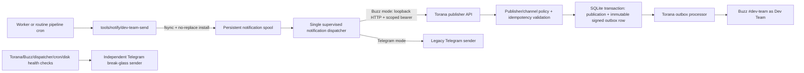

# Dev Team Buzz Notification Migration — Implementation Plan

## 1. Outcome and recommendation

Build a generic, outbound-only publisher capability in Torana, then use it to move routine automated development-pipeline notifications from Telegram to Buzz `#dev-team`.

The Dev Team publisher is a service principal, not an LLM persona:

- it has no runner, prompt, memory, Agent API `ask` target, commands, inbound message handling, DMs, mention responses, feed triggers, workflow triggers, or heartbeat triggers;
- Torana alone owns its Buzz signing key and owner authorization tag;
- routine callers receive no Torana credential; only the dedicated notification dispatcher receives a least-privilege publishing bearer, which cannot select another endpoint, identity, relay, or channel;
- within the 14-day idempotency window, one logical notification is durably accepted at most once and produces one immutable signed Buzz event; callers expire after 7 days and never retry beyond that server window;
- routine notifications use exactly one transport at a time;
- an independent Telegram break-glass path reports failures in Torana, Buzz, the notification dispatcher, cron, or disk capacity.

The target Buzz identity and destination are fixed for this build:

- publisher display identity: `Dev Team`;
- expected public key: `4d66facf35826891790efa742e0e915a906fed1d39e860e8c8ff9c8001ef6911`;
- expected npub: `npub1f4n04ne4sf5fz7gwlf6zur53t2gxlmga885xp6xgl7wgqq00dygs2x8hu5`;
- destination channel: Buzz `#dev-team`;
- destination channel ID: `4109b9b8-c553-4d29-98f5-403d8419ac18`.

No implementation task may request, print, log, commit, copy into task context, or expose the corresponding private key or owner auth tag. Jason supplies those values directly to Railway outside chat and source control at the deployment gate.

## 2. Build principles and non-negotiable success criteria

### 2.1 Security

1. The private key and auth tag exist only in Railway/operator secret storage, root-owned ephemeral handoff files, and the Torana process environment at runtime. They never enter the persistent `/data` volume.
2. Non-Torana supervisord programs, worker harnesses, LLM subprocesses, cron LLM jobs, logs, metrics, task context, retry drops, and repository files do not contain Buzz private material.
3. The publishing bearer exists only in the Torana and notification-dispatcher process environments. It authorizes only `publish` and `status` for publisher `dev-team`; it cannot invoke `ask`, runner-backed `send`, administrative actions, another publisher, or another destination.
4. The publish request does not accept endpoint ID, channel ID, relay URL, private key, auth tag, event tags, reply target, mentions, or arbitrary Nostr event fields.
5. Torana derives the public key from the configured private key and fails configuration validation unless it exactly matches the pinned Dev Team public key.
6. The route remains loopback-only in production. The existing public gateway proxy continues returning 404 for all `/v1/*` routes.
7. Error bodies, process arguments, logs, status output, metrics, and traces contain safe identifiers and bounded error classes only. They never contain tokens, auth tags, private keys, signed payload bodies, or full notification content.
8. This is defense in depth inside one Torana container, not a sandbox boundary. A fully compromised same-container process remains in the installation trust domain. Hard isolation requires a separate Torana installation/container and is outside this migration.

### 2.2 Reliability

1. Producer success means the logical event was fsynced into the persistent local spool with an immutable idempotency key. Torana HTTP success separately means the idempotency record and immutable signed outbox event committed in one SQLite transaction.
2. While the 14-day idempotency record is retained, a retry with the same publisher, idempotency key, and payload returns the original publication/outbox identity and never creates a second signed event.
3. Reusing an idempotency key with different canonical content returns `409 idempotency_conflict` and changes nothing.
4. Crash-after-sign, crash-after-enqueue, timeout-after-accept, lost relay acknowledgement, process restart, and repeated caller retries are covered by automated tests.
5. Buzz relay retries always reuse the persisted signed event bytes and event ID.
6. Only one notification dispatcher owns the retry directory. Per-role worker drainers no longer race over the same files.
7. Retry-drop writes, claims, retry updates, dead-letter moves, and recovery from stale in-flight claims are atomic.
8. The dispatcher continues running when `WORKERS_ENABLED=0`; pausing task claims must not pause notification recovery.
9. Any dead letter creates an independent break-glass alert. The failure alert does not use the failing Dev Team Buzz publisher.
10. Rollback explicitly reconciles ambiguous requests and pending Buzz outbox rows before routine Telegram delivery resumes.
11. Buzz publications use a dedicated outbox origin and publisher-specific limits; they do not consume or trigger conversational reply-loop budgets, runner alerts, or bot-registry assumptions.
12. Telegram-mode stale in-flight records that might already have been accepted are quarantined for operator reconciliation, never automatically replayed.

### 2.3 Observable operating targets

- Producer-to-spool durable-accept latency: p95 under 250 milliseconds on the mounted volume.
- Dispatcher-to-Torana durable-accept latency: p95 under 2 seconds while Torana is healthy.
- Healthy-relay delivery: p95 under 60 seconds from producer spool acceptance.
- Publisher request timeout: 5 seconds; timeout is treated as ambiguous and retried with the same idempotency key.
- Publisher server-side enqueue deadline: 4 seconds with a 2-second SQLite busy ceiling, so the server finishes or rolls back before the dispatcher's 5-second client timeout.
- Publisher idempotency retention: 14 days, strictly longer than the 7-day caller retry and rollback-reconciliation window.
- Publisher pending-outbox soft alert: more than 10 rows for 10 minutes.
- Publisher pending-outbox hard bound: 500 rows; new requests fail with a retriable `503 publisher_backlog_full` before disk growth becomes unbounded.
- Publisher retained-outbox hard bound: 2,000 rows or 256 MiB of payload/signed-payload bytes across all statuses; the global logical database cap must also reserve room for the maximum request.
- Any publisher dead/failed outbox row: immediate break-glass alert.
- Caller retry budget: full-jitter exponential backoff from 5 seconds, capped at 6 hours, with at most 32 attempts or 7 days of age, whichever comes first; a warning is raised after three consecutive failures and exhaustion atomically dead-letters the record.
- Local spool hard bound: 1,000 non-terminal records, 64 MiB of non-terminal data, or 128 MiB total including retained terminal/quarantine data, whichever is reached first; producer enqueue fails loudly before exceeding any bound. Soft alert at 100 non-terminal records or an oldest age of 10 minutes.
- Pending caller drops older than 7 days move to dead letter with a break-glass alert; caller dead-letter retention is 30 days. Spool directories are mode `0700`, files are mode `0600`, and full message bodies are never copied into logs. Publisher-publication rows are swept before referenced terminal outbox rows; non-terminal rows are never swept. Torana currently declares sent/dead outbox retention but does not implement an outbox sweep, so Ticket 2 owns the ordered retention implementation rather than assuming it exists.

## 3. Current baseline and repository ownership

Re-check these values at the start of each ticket because all three repositories can move independently.

| Repository           | Current verified baseline                                         | Owns                                                                                                                                                       |
| -------------------- | ----------------------------------------------------------------- | ---------------------------------------------------------------------------------------------------------------------------------------------------------- |
| `torana`             | `main` at `c8a9799`; package `2.0.0-rc.1`; SQLite schema v5       | Generic no-runner publisher model, publisher API/auth, idempotency transaction, signed Buzz outbox integration, status/metrics/CLI, migration and release  |
| `agent-team`         | `main` at `a54236d`; Dockerfile pins `torana@2.0.0-rc.1`          | Railway image, Torana config, secret handling, supervisord environment, one notification dispatcher process, disabled deployment, rollback controls        |
| `agent-team-content` | `main` at `bdaea80`; source design at the path in the frontmatter | Transport-neutral notification CLI, retry-drop schema, worker terminal/slice-pause adapter, cron caller migration, tests and operator-facing pipeline docs |

Current Torana facts that shape the build:

- `POST /v1/bots/:bot_id/send` creates a synthetic inbound turn and dispatches a runner. It is not a direct publisher.
- Config v2 requires every `agents[]` entry to have a runner.
- `OutboxProcessor.queueOperation()` already supports turnless durable Buzz sends with immutable signed event persistence, but it treats a turnless Buzz send as conversational reply traffic and applies loop budgets. Publisher enqueue therefore needs an explicit `publisher` origin/dedicated method.
- Agent API scopes are currently only `ask | send`.
- The current schema has no publisher idempotency table and current binaries reject schema versions newer than v5.
- Retention configuration declares 14-day sent and 90-day dead outbox windows, but current main has no outbox-row sweeper.

Therefore the publisher capability must land and be released from Torana before either deployment or caller migration begins.

## 4. Target architecture



Routine producers never make a network delivery attempt. They only durably enqueue a transport-pinned logical event. This keeps both the publisher bearer and routine Telegram credentials out of worker and cron LLM environments, centralizes retries, and makes marker ordering deterministic. In Buzz mode, a dispatcher crash after Torana accepts is safe because the same key is reconciled/replayed. In Telegram mode, a stale claim with a recorded send attempt is quarantined instead of automatically retried because Telegram has no equivalent idempotency contract.

### 4.1 Responsibility boundaries

| Component                      | Repository                                         | Responsibility                                                                                                                                                                   |
| ------------------------------ | -------------------------------------------------- | -------------------------------------------------------------------------------------------------------------------------------------------------------------------------------- |
| Publisher config/runtime       | `torana`                                           | Represent an outbound-only service principal with no runner or inbound dispatch surface                                                                                          |
| Publisher API and CLI          | `torana`                                           | Authenticate, validate, deduplicate, atomically enqueue, report status, and expose a generic `torana publish` client command                                                     |
| Buzz adapter/outbox            | `torana`                                           | Derive/pin identity, sign once, persist before acknowledgement, retry exact bytes, classify failures, expose metrics                                                             |
| Deployment and secret boundary | `agent-team`                                       | Install the exact Torana release, configure Dev Team disabled-first, scrub raw Buzz secrets before supervisord, and inject the scoped bearer only into Torana and the dispatcher |
| Notification adapter           | `agent-team-content`                               | Preserve existing text/file/drop inputs, generate/reuse logical idempotency keys, and atomically fsync every routine notification into the local spool                           |
| Notification dispatcher        | content implementation plus core supervisord block | Exclusively own the spool, hold the selected transport credential, claim files atomically, reconcile ambiguous accepts, retry, quarantine, and dead-letter                       |
| Routine caller migrations      | `agent-team-content`                               | Replace Telegram-specific invocation without changing notification thresholds, formatting, or task semantics                                                                     |
| Break-glass alerting           | existing Telegram sender                           | Report failures in the new delivery control plane without depending on Torana/Buzz                                                                                               |

## 5. Torana publisher contract

### 5.1 Configuration model

Add a top-level `publishers` collection to config v2. It is deliberately separate from `agents` so it cannot accidentally acquire a runner or conversational behavior.

Normative first-release shape (field names and defaults are contract; only secret values and the eventual release version vary):

```yaml
publishers:
  - id: dev-team
    enabled: false
    endpoint:
      id: dev-team-buzz
      platform: buzz
      community_id: primary
      relay_url: ${BUZZ_RELAY_URL}
      private_key: ${BUZZ_PRIVATE_KEY_DEV_TEAM}
      auth_tag: ${BUZZ_AUTH_TAG_DEV_TEAM}
      owner_pubkey: ${BUZZ_OWNER_PUBKEY}
      expected_pubkey: 4d66facf35826891790efa742e0e915a906fed1d39e860e8c8ff9c8001ef6911
    destination:
      external_conversation_id: 4109b9b8-c553-4d29-98f5-403d8419ac18

publisher_api:
  enabled: true
  max_body_bytes: 73728
  max_content_bytes: 65536
  idempotency_retention_ms: 1209600000
  max_pending_per_publisher: 500
  max_retained_per_publisher: 2000
  max_retained_bytes_per_publisher: 268435456
  rate_per_minute_per_publisher: 60
  burst_per_publisher: 10
  tokens:
    - name: dev-team-notifier
      secret_ref: ${TORANA_PUBLISH_TOKEN_DEV_TEAM}
      publisher_ids: [dev-team]
      scopes: [publish, status]
```

Required validation:

- publisher IDs and endpoint IDs are globally unique;
- publisher endpoints support Buzz only in the first release;
- no runner, commands, triggers, inbound subscription mode, tool policy, or response policy can be configured on a publisher;
- the derived public key equals `expected_pubkey`;
- the owner auth tag is valid for the derived key, owner, and core message event kind;
- static validation proves the destination is a UUID; a separate authenticated publisher probe must prove live membership before activation because a disabled endpoint does not connect;
- a publisher token may reference only declared publishers and may use only `publish | status`;
- publisher tokens cannot be accepted by bot `ask`, bot `send`, broker, or admin routes;
- secret-bearing paths are included in redaction and sanitized config output.

Internally, an existing `agent_id` database column may temporarily store the publisher's stable principal ID to avoid a broad schema rename, but no `Bot`, runner factory, scheduler slot, or conversation session may be created for it. The normalized runtime model must explicitly preserve `principal_kind = publisher` so no code path infers conversational capability from the legacy column name.

### 5.2 HTTP API

#### Publish

`POST /v1/publishers/:publisher_id/messages`

Headers:

```text
Authorization: Bearer <publisher token>
Idempotency-Key: <value matching ^[A-Za-z0-9_-]{16,128}$>
Content-Type: application/json
```

Body:

```json
{
  "content": "plain text or Buzz Markdown",
  "source": "worker-terminal",
  "severity": "info"
}
```

Validation:

- `content`: non-empty valid UTF-8, bounded by the lower of publisher API and Buzz content limits;
- `source`: lowercase `[a-z0-9_-]{1,64}`;
- `severity`: `info | warning | error`;
- unknown fields are rejected;
- null bytes and disallowed control characters are rejected;
- endpoint, channel, relay, tags, identity, reply target, mention target, file, and event-kind overrides are impossible because they are absent from the schema.

Success response, including exact replay:

```json
{
  "publication_id": 123,
  "outbox_id": 456,
  "status": "accepted",
  "replayed": false
}
```

Return `202` only after the transaction commits. Exact idempotent replay returns the same IDs with `replayed: true`. A key reused with a different payload digest returns `409 idempotency_conflict`.

Other required errors:

- `401/403`: missing/invalid token, wrong scope, or wrong publisher;
- `404`: unknown or unauthorized publisher, without enumeration detail;
- `413`: body/content too large;
- `422`: invalid content/source/severity;
- `429`: publisher request-rate limit;
- `503 publisher_disabled`, `publisher_draining`, `publisher_unhealthy`, `publisher_backlog_full`, `publisher_retained_storage_full`, or `database_busy` with a safe retriable classification;
- `507 database_storage_full` when the configured global logical database cap cannot safely admit the maximum request.

#### Status and ambiguous-request reconciliation

`POST /v1/publishers/:publisher_id/messages/status`

Body:

```json
{ "idempotency_key": "<same bounded key>" }
```

The status scope returns publication ID, outbox ID, bounded outbox status (`pending | in_flight | retrying | sent | failed | dead`), safe error class, and timestamps. It never returns content or signed payload bytes. The key is carried in a bounded JSON body, not a URL or query string, so ordinary access logs do not disclose logical event identifiers. The notification dispatcher uses this route before moving an ambiguously attempted Buzz drop to Telegram during rollback.

One `publication_not_found` response is not proof of absence because it could race an earlier timed-out handler. A Buzz attempt becomes “proved absent” only when the publisher is healthy, at least 60 seconds have elapsed since `attempt_started_at`, and two authorized status requests five seconds apart both return `publication_not_found`. The 4-second server deadline guarantees the original transaction has committed or rolled back before this proof window. Any deadline violation, unhealthy publisher, inconsistent result, or lookup error remains ambiguous and is quarantined rather than copied to Telegram.

### 5.3 Idempotency and database transaction

Add schema migration `0006_publisher_publications.sql` and advance the schema version from v5 to v6.

Minimum table contract:

```sql
CREATE TABLE publisher_publications (
  id INTEGER PRIMARY KEY AUTOINCREMENT,
  publisher_id TEXT NOT NULL,
  idempotency_key TEXT NOT NULL,
  payload_sha256 TEXT NOT NULL,
  outbox_id INTEGER NOT NULL REFERENCES outbox(id) ON DELETE RESTRICT,
  created_at TEXT NOT NULL DEFAULT (datetime('now')),
  UNIQUE (publisher_id, idempotency_key)
);

CREATE INDEX idx_publisher_publications_created
  ON publisher_publications(created_at);
```

Canonical request bytes are UTF-8 JSON with exactly the validated `content`, `severity`, and `source` keys in lexicographic order, no insignificant whitespace, and non-ASCII characters emitted directly. Strings are not Unicode-normalized. Python and TypeScript golden vectors must produce the same SHA-256 digest. Torana computes and trusts its own digest; a caller-supplied digest is never authoritative.

The transaction must:

1. begin with an immediate SQLite transaction;
2. resolve the configured publisher and fixed destination conversation;
3. check `(publisher_id, idempotency_key)` and return the existing row for an exact digest/transport-independent request match even if the publisher is now draining or full;
4. reject a digest mismatch;
5. for a new key, check lifecycle, per-publisher rate, pending count, retained outbox row/byte count, and the configured logical database cap under the same write lock so concurrent requests cannot bypass a hard bound;
6. prepare and sign the outbound event exactly once for the winning insert, using the synchronous no-attachment Buzz path and performing no network or filesystem I/O while the SQLite write lock is held;
7. insert the immutable outbox row and publication row;
8. commit before returning `202`.

Concurrent requests with the same key must converge on one row. The publisher path uses a dedicated `queuePublisherOperation()` rather than the current conversational `queueOperation()` contract. It resolves the adapter by publisher endpoint, bypasses conversational reply-loop budgets and bot/runner alerts, and enforces only publisher rate/backlog policy. Tests prove publisher and conversational budgets cannot affect each other and that no BotRegistry entry is required.

The hourly retention transaction deletes only terminal publisher-publication rows older than 14 days, then deletes eligible unreferenced terminal outbox rows using `retention.sent_outbox_days` and `retention.dead_outbox_days`. The `RESTRICT` foreign key makes incorrect ordering fail closed. Pending, retrying, or in-flight publication/outbox rows are never swept. New publisher intake also atomically caps all retained publisher-origin outbox rows and their UTF-8 payload/signed-payload bytes, including sent/failed/dead rows whose longer outbox retention outlives the idempotency row. The logical SQLite page bound reserves one maximum request before insert; WAL/checkpoint size is monitored separately. Tests cover exact time boundaries, rapid terminal-row accumulation, a flat-database soak, restart, a forced sweep/checkpoint failure, and proof that the status route remains available for the complete 7-day caller reconciliation window.

### 5.4 Outbound-only runtime behavior

- A publisher endpoint connects/authenticates and tracks only the membership information required to prove destination access and deliver outbound events.
- It does not subscribe to ordinary channel messages, DMs, mentions, workflows, or feeds.
- It never registers with the conversation scheduler or runner factory.
- `disabled` rejects new publications and pauses delivery.
- `active` accepts and delivers.
- `draining` rejects new publications while allowing accepted outbox rows to reach a terminal state.
- Auth, key, policy, and membership failures are non-retriable and move the row to failed/dead with a safe error class.
- Relay disconnect, timeout, rate limit, and uncertain acknowledgement are retriable; uncertain acknowledgement republishes the exact stored event.
- `torana doctor` gains an explicit publisher probe that transiently authenticates, derives/verifies the pinned identity, and confirms membership for the configured channel without enabling publish intake. Config validation alone must not claim live membership proof.

### 5.5 Generic Torana CLI

Add:

```text
torana publish <publisher_id> --source <label> --severity <level>
  [--idempotency-key <key>] [--server <url>] [--token-file <path>]
  [--stdin | --file <path>]

torana publish status <publisher_id> --idempotency-key <key>
  [--server <url>] [--token-file <path>]
```

The CLI:

- sends JSON directly without shell interpolation;
- rejects positional content so notification bodies never appear in process arguments;
- resolves credentials from an explicit protected token file, environment, or profile; it does not accept a raw bearer in process arguments;
- generates a cryptographically random idempotency key only when a caller does not provide one and prints that key to stderr for manual reuse;
- treats exact replay as success;
- maps retriable vs non-retriable server responses to documented stable exit codes;
- never prints the bearer or response bodies that could contain secrets;
- supports JSON output for the dispatcher and human-readable safe output by default.

Stable Torana publish CLI exits are normative: `0` accepted/exact replay/status found; `2` CLI usage or local input validation; `3` authentication/authorization; `4` permanent server rejection or idempotency conflict/not-found status; `5` retriable server, timeout, connection, or protocol failure. JSON mode emits the same bounded error class and never changes the exit mapping.

## 6. Content notification contract

### 6.1 Transport-neutral sender

Create `agent-team-content:tools/notify/dev-team-send` as a typed Python 3.11+ CLI using only the standard library and list-form subprocess arguments.

It preserves the useful legacy interface:

```text
dev-team-send [--markdown] --stdin
dev-team-send [--markdown] --file <text-file>
dev-team-send [--markdown] --from-file <json-drop>
dev-team-send --idempotency-key <key> [--stdin | --file <text-file>]
```

`--markdown` is a content-format hint only; it never changes routing or permits raw event fields.

Environment contract:

- `DEV_TEAM_NOTIFY_TRANSPORT=telegram|buzz`;
- `DEV_TEAM_NOTIFY_SEND_CLI=/data/content/tools/notify/dev-team-send` for worker/core wiring;
- `DEV_TEAM_NOTIFICATION_DIR=/data/state/workers/notifications`;
- `TORANA_SERVER=http://127.0.0.1:3001` only in the dedicated dispatcher environment;
- `TORANA_PUBLISH_TOKEN_DEV_TEAM` only in the Torana and dedicated dispatcher process environments;
- `DEV_TEAM_BREAK_GLASS_SEND_CLI=/data/content/tools/telegram/send` only for the control-plane alert allowlist.

The sender performs no network calls and reads no transport credential. It returns 0 only after it writes a same-filesystem temporary file, fsyncs the file, installs the final pending record with no-replace atomic semantics, and fsyncs the parent directory. An exact duplicate key/digest/transport already present in pending, in-flight, or completed state is replay success; the same key with a different digest or transport is a permanent conflict; a matching dead/quarantined record is a non-zero operator-required result. If the local durable enqueue fails, caller markers do not advance.

Stable producer exits are normative: `0` new durable enqueue or exact local replay; `2` usage/input validation; `4` key/digest/transport conflict; `6` lock, filesystem, fsync, capacity, or permission failure; `7` matching ambiguous/dead record requiring operator action. Routine callers treat only `0` as marker-advancing success.

The spool has `tmp/`, `pending/`, `inflight/`, `completed/`, `ambiguous/`, `reconciliation/`, `reconciled/`, and `dead/` subdirectories. Enqueue and every dispatcher state transition take an exclusive `fcntl.flock` on `spool.lock`, with a 2-second producer acquisition timeout, while checking all directories for the key and enforcing count/byte bounds; network I/O occurs only after the lock is released. A record is installed without replacement by hard-linking its fsynced same-filesystem temporary file to the final name, then unlinking the temporary name and fsyncing both directories. This prevents overwrite and enqueue/claim races using Python's standard library. It never follows symlinks, accepts only regular files owned by the runtime user, and rejects unsafe filenames or cross-filesystem directory configuration.

A confirmed delivery atomically renames the in-flight record to `completed/` and fsyncs both directory entries. Completed records are retained for 14 days as local idempotency tombstones, then swept; they are mode `0600` and remain subject to the total spool byte bound. Dead records are retained for 30 days. Ambiguous Telegram records require an operator decision and are never age-swept automatically; the total byte bound prevents unbounded growth.

### 6.2 Retry-drop schema

All new drops use schema version 2:

```json
{
  "schema_version": 2,
  "event": "task_terminal",
  "transport": "buzz",
  "idempotency_key": "task-terminal-...",
  "payload_sha256": "...",
  "message": "...",
  "source": "worker-terminal",
  "severity": "info",
  "created_at": "...",
  "retry_count": 0,
  "next_attempt_at": "...",
  "attempt_started_at": null,
  "last_attempt_transport": null,
  "last_error_class": null
}
```

The idempotency key is generated before the first durable enqueue and remains unchanged in the spool record and every dispatch attempt. It is a logical event identity, not merely a content hash:

- task terminal: random event ID generated once for the terminal transition, with task/outcome retained as audit metadata;
- slice pause: random event ID generated once for that pause event;
- cron alert: stable key derived from alert class plus the cron's existing suppression/alert window;
- manual send: random key printed for reuse unless explicitly supplied.

The transport is selected and persisted at enqueue time; changing the global environment never silently retargets an existing record. The payload digest uses the canonical request bytes in §5.3 and detects accidental key reuse with changed content.

Legacy drops without an idempotency key are upgraded atomically before dispatch, with `transport: telegram` to preserve original intent. The generated key is persisted before any network call.

### 6.3 Single notification dispatcher

Create one continuously supervised dispatcher rather than allowing every role drainer to scan the same directory.

Legacy per-role scanning and the dedicated dispatcher are mutually exclusive. The core deployment first ships a feature flag with the dispatcher off. During activation, task claims are paused, the legacy scanners are disabled, and the dispatcher is enabled in one controlled restart. Startup validation fails if both ownership modes are enabled.

Required behavior:

- runs regardless of `WORKERS_ENABLED`;
- wakes every 5 seconds with monotonic-clock scheduling;
- atomically renames one eligible `.json` file to an in-flight name before reading/sending;
- treats a claim as stale after 60 seconds; a pre-attempt claim returns to pending, a Buzz post-attempt claim enters status reconciliation, and a Telegram post-attempt claim enters ambiguous quarantine;
- retries with the stored idempotency key and exponential backoff;
- atomically replaces and fsyncs the claimed record with `attempt_started_at` before the network call;
- for Buzz, reconciles any stale/ambiguous attempt through the body-based status route and retries only with the same key;
- for Telegram, automatically retries only a claim proven to have crashed before `attempt_started_at`; a stale post-attempt claim moves to `notifications/ambiguous/` for operator reconciliation and is never automatically resent;
- on success, atomically moves the claimed file to `completed/` only after the selected transport's confirmed API success and directory fsyncs;
- after the retry budget, atomically moves the record to `notifications/dead/` with safe error metadata;
- moves pending records older than 7 days to `notifications/dead/` rather than retrying forever;
- emits a break-glass Telegram alert for each newly dead-lettered record, subject to deduplicated cooldown;
- never logs the full notification body or bearer;
- exposes pending, in-flight, oldest-age, retry, success, and dead counts through the existing health/forensics mechanism.

The dispatcher is the only routine process that receives the publisher bearer. In Buzz mode it calls the loopback publisher API directly in-process with bounded standard-library HTTP; it does not place the bearer in a child environment or command argument. In Telegram mode it invokes the legacy sender from the dispatcher. Break-glass scripts remain separate direct Telegram callers.

Continuous runtime detection uses a process outside supervisord's failure domain. Entrypoint hands off to a small `runtime-supervisor` parent that starts supervisord and an independent watchdog, forwards shutdown signals, and waits for either. Cron writes a heartbeat every 60 seconds and the dispatcher every 5 seconds using atomic replace plus directory fsync. After a 180-second startup grace, the watchdog polls every 10 seconds and treats dispatcher heartbeat age over 30 seconds or cron heartbeat age over 180 seconds as stale. It also checks required supervisor process states through the local supervisor socket. On missing/fatal/stale state, it sends the direct Telegram break-glass alert, writes a safe health artifact/structured stderr signal even if Telegram fails, and exits with code 70. The parent terminates supervisord cleanly but exits with the watchdog's non-zero code, allowing Railway's existing `ON_FAILURE` policy to restart the container. Tests use injected clocks and cover exact boundaries, signal forwarding, no orphaned children, repeated restart behavior, and the alert-failure path.

The public proxy's `/health` response combines Torana readiness with a fresh watchdog-ready artifact, and `railway.toml` sets that deployment health-check path. This prevents an unhealthy new deployment from activating, but is not the continuous monitor: Railway documents that deployment health checks are startup-only, so the independent watchdog/non-zero container exit remains required ([Railway health-check behavior](https://docs.railway.com/deployments/healthchecks)).

Remove the notification-directory scan from `agent-team:deploy/workers/worker-drainer.sh` only after the dedicated dispatcher is deployed and proven to recover existing pending files.

### 6.4 Operator reconciliation command

Add `tools/notify/dev-team-reconcile` for the only allowed manual transitions out of `ambiguous/` or cross-transport rollback. It requires the safe record ID, one decision (`mark-delivered | replace-telegram | dead-letter`), an operator label matching `[A-Za-z0-9._-]{1,64}`, and one bounded reason code (`telegram-visible | buzz-absence-confirmed | operator-dead-letter`). It never accepts free-form reason text, message content, or credentials in arguments.

The command acquires `spool.lock` and writes a fsynced no-replace intent under `reconciliation/` before changing state. A Telegram replacement gets a new idempotency key and records the original key plus the completed two-probe absence evidence. The command then atomically installs the replacement if needed, renames the original to `reconciled/` or `completed/`, marks the intent complete by atomic replace, and fsyncs every affected directory. Startup recovery replays incomplete intents idempotently. Tests inject a crash after every filesystem operation and prove the result is exactly one replacement or a still-recoverable original, never both deliverable records.

Stable reconciliation exits are `0` completed or exact recovery replay; `2` invalid arguments/decision; `6` lock/filesystem/fsync failure; `7` missing evidence, state conflict, or an original that is not eligible. No other tool may move an ambiguous record back to pending.

## 7. Caller classification and migration scope

### 7.1 Move to Buzz `#dev-team`

- `worker_lib.notify_terminal` for pipeline roles;
- `worker_lib.notify_slice_pause`;
- task health, chain staleness, defect staleness, orphan accumulation;
- waiting-for-merge escalation and human-merge reconciliation automation;
- Linear webhook failure/reconcile and Alfred intake/spool backlog automation when the message is raw automated status rather than Alfred-authored commentary;
- code-reviewer and tech-lead shadow comparison summaries;
- the daily dev-pipeline summary.

Pipeline-role terminal notifications stop making the additive runner-backed copy to Alfred. Alfred-authored analysis and commentary remains a separate `#dev-pipeline` stream and is not sent by the Dev Team publisher.

### 7.2 Retain on independent Telegram break-glass path

These detect failure of infrastructure required to deliver Buzz notifications and must not depend on that same path:

- `tools/crons/torana-health-probe.sh`;
- `tools/crons/supercronic-failure-alert.sh`;
- `tools/crons/cron-heartbeat-alert.sh`;
- `tools/crons/disk-free-alert.sh`;
- notification-dispatcher dead letters or process-health failure;
- publisher disabled/unhealthy state, auth or membership failure, backlog threshold breach, and any Torana publisher outbox dead/failed row.

This is not routine dual-send. Telegram is silent during healthy operation except for control-plane failures and urgent break-glass escalation.

`supercronic-failure-alert.sh` currently detects failed jobs by parsing supercronic's own log and is itself scheduled by supercronic, so it cannot prove that the cron daemon is alive. The runtime-supervisor watchdog in §6.3 supplies that independent cron/dispatcher liveness check; supervisord remains the first restart layer, and the watchdog-triggered non-zero container exit is the outer recovery layer.

### 7.3 Explicitly out of scope

- Harper content batches;
- Trader settlement reports;
- Cato digest delivery;
- producer-specific human notifications unrelated to dev-pipeline operation;
- Alfred-authored `#dev-pipeline` commentary;
- interactive Dev Team conversations;
- attachments, edits, reactions, replies, mentions, DMs, workflows, canvas, repositories, or administration through the publisher API.

## 8. Sequenced implementation tickets

Every ticket is independently reviewable. Do not begin a dependent ticket until the named merge, release, migration, deployment, or canary gate is complete.

### Ticket 0 — Freeze contracts and capture a green baseline

- **Repository:** `torana`, with read-only evidence from the other two repositories.
- **Dependencies:** none.
- **Work:** Record current SHAs, package/schema versions, current notification caller inventory, current public proxy behavior, and current full-suite results. Add an ADR or contract test fixture for the publisher API/config shapes in this plan before implementation starts.
- **Acceptance criteria:**
  1. All referenced paths exist and the caller inventory classifies every direct Telegram dev-pipeline sender as Buzz, break-glass, or out of scope.
  2. Torana full tests, typecheck, lint, format check, build, and whitespace check pass before code changes.
  3. Agent-team core tests and content worker/cron tests pass before code changes.
  4. Any pre-existing failure is documented and resolved or explicitly excluded before Ticket 1.
- **Rollback:** none; evidence-only.

### Ticket 1 — Add publisher configuration and least-privilege auth

- **Repository:** `torana`.
- **Dependencies:** Ticket 0.
- **Primary files:** `src/config/v2.ts`, `src/config/load.ts`, `src/config/schema.ts`, `src/agent-api/auth.ts`, `src/agent-api/types.ts`, configuration/docs tests.
- **Acceptance criteria:**
  1. Config v2 accepts a top-level outbound-only publisher and rejects runner/inbound fields.
  2. `expected_pubkey` derivation mismatch is a fatal, redacted validation error.
  3. Publisher API tokens are independent from bot tokens and cannot authorize bot, broker, or admin routes.
  4. Cross-publisher and cross-destination attempts fail without enumeration detail.
  5. Per-publisher request rate and burst limits have bounded defaults and validated overrides.
  6. Config/doctor output redacts all new secret paths; static validation does not misreport live membership.
  7. Unit and security tests cover missing, malformed, literal, duplicate, cross-referenced, and wrong-scope configurations.
- **Rollback:** revert; no schema or production config changes yet.

### Ticket 2 — Add schema v6 atomic publisher idempotency and outbox enqueue

- **Repository:** `torana`.
- **Dependencies:** Ticket 1.
- **Primary files:** `src/db/migrations/0006_publisher_publications.sql`, `src/db/migrate.ts`, `src/db/gateway-db.ts`, `src/outbox.ts`, DB/migration tests.
- **Acceptance criteria:**
  1. v5→v6 migration is transactional, snapshot-backed, concurrency-locked, and idempotent on rerun.
  2. Fresh databases create the same v6 schema as migrated databases.
  3. Publication and signed outbox insert commit atomically.
  4. Exact retries and concurrent same-key requests return one publication/outbox/event ID.
  5. Same key plus different payload returns conflict without modifying either row.
  6. Crash injection before commit leaves neither row; crash after commit leaves both recoverable.
  7. The dedicated publisher enqueue origin bypasses conversational loop budgets and bot/runner alert paths while remaining subject to atomic publisher rate/backlog limits.
  8. Fourteen-day publication retention and configured outbox retention run in publication-first order; non-terminal rows and the complete caller-reconciliation window are preserved.
  9. Database busy, concurrent pending/retained row/byte/database bounds, rapid terminal-row accumulation, retention/checkpoint failure, and flat-database soak behavior are bounded, retriable, and tested.
- **Rollback:** restore the automatic pre-v6 snapshot only if migration itself is defective. After production accepts v6 data, binary rollback targets must understand v6.

### Ticket 3 — Add outbound-only runtime, publisher API, CLI, metrics, and security tests

- **Repository:** `torana`.
- **Dependencies:** Ticket 2.
- **Primary files:** new `src/publisher/` runtime, auth, router, and service modules registered from `src/main.ts`; `src/cli.ts` and a new publish CLI module; Buzz transport/runtime registration; metrics, operations, security and release docs/tests. Publisher routes do not extend the runner-backed agent API router.
- **Acceptance criteria:**
  1. Publisher starts without a runner and creates no scheduler/session state.
  2. It subscribes only to membership/health information needed for outbound delivery.
  3. Publish/status routes implement the exact contract in §5, with no idempotency key in a URL, query string, or access log.
  4. API success occurs only after durable signed enqueue.
  5. Fake-relay tests cover healthy delivery, disconnect, rate limit, rejected auth, lost membership, dropped/negative acknowledgement, exact-event replay, restart, and dead-letter behavior.
  6. Request-size, slow-body, null-byte, source injection, unknown-field, cross-publisher, wrong-scope, token timing, log-redaction, metrics-label, and idempotency-conflict security tests pass.
  7. `torana publish`, `torana publish status`, and the disabled publisher probe preserve idempotency keys, use stable exit codes, and never print credentials or content.
  8. Publisher health, backlog, accept, replay, retry, sent, failed, dead, and latency metrics contain bounded labels only.
  9. Full Torana suite, typecheck, lint, formatting, build, `git diff --check`, and package-content inspection pass.
- **Release gate:** publish the next available prerelease determined after Ticket 0's version re-check, then pin and record its exact version, package checksum, and release commit. Do not configure Dev Team yet; floating tags/ranges are forbidden.
- **Rollback:** deploy the same v6-capable binary with no publishers configured. Do not return to a v5-only binary after migration except by restoring the pre-v6 snapshot.

### Ticket 4 — Deploy the v6-capable Torana release with the publisher absent/disabled

- **Repository:** `agent-team`.
- **Dependencies:** Ticket 3 release.
- **Work:** Pin the exact Torana release, add the explicit entrypoint migration gate below, deploy with no active Dev Team publisher, and soak the unchanged Telegram/Agent API/Buzz agents.
- **Exact first-deploy sequence:** Build and rehearse the release image against a copy of the production v5 database. For the first production boot only, set `TORANA_SCHEMA_MIGRATION_TARGET=6` and `TORANA_SCHEMA_MIGRATION_ACK=<reviewed-0006-sha256>`. Before supervisord starts any process, entrypoint verifies the installed Torana version and migration checksum, runs `torana migrate --config /app/deploy/torana-config/torana.yaml --to 6 --dry-run`, applies the same command without `--dry-run`, verifies schema/invariants, and writes a non-secret success sentinel. A missing/wrong acknowledgement or any failed verification exits before supervisord. Subsequent boots accept an already-v6 database idempotently; remove the one-shot variables after the disabled soak. The prior v5 image is removed from automatic rollback once the shared volume reaches v6.
- **Acceptance criteria:**
  1. Docker build verifies the exact Torana version and Buzz CLI checksum.
  2. The exact v5→v6 CLI path, migration checksum acknowledgement, automatic pre-v6 snapshot, apply, post-check, failure-before-supervisord, and idempotent rerun pass in the release image.
  3. Existing Telegram, Agent API, and active Buzz endpoints retain behavior.
  4. Publisher route returns unavailable/not configured and creates no rows.
  5. Endpoint, conversation, session, and outbox health remain normal for a minimum 24-hour soak.
  6. The pre-v6 snapshot path, checksum, sentinel, and known-good v6-compatible disabled-binary rollback procedure are recorded.
- **Rollback:** keep the v6 binary and remove/omit publisher config. Snapshot restore is emergency-only because it discards post-migration writes.

### Ticket 5 — Configure Dev Team disabled-first and harden secret/environment handling

- **Repository:** `agent-team`.
- **Dependencies:** Ticket 4 soak.
- **Primary files:** `deploy/torana-config/torana.yaml`, `deploy/entrypoint.sh`, new Torana/dispatcher start wrappers, `deploy/supervisord.conf`, Docker dependency assertions, deployment tests, `deploy/README.md`, `deploy/RUNBOOK.md`.
- **Required injection mechanism:** With `umask 077`, entrypoint writes each `BUZZ_PRIVATE_KEY_*`, `BUZZ_AUTH_TAG_*`, and `TORANA_PUBLISH_TOKEN_DEV_TEAM` value to a separate root-owned `0600` file below the fixed ephemeral non-volume directory `/run/torana-secrets`, then unsets those variables before starting the runtime-supervisor. The directory is root-owned `0700`. Files remain there for the container lifetime so supervised restarts work; a fresh container recreates them from current Railway secrets, and they never persist to `/data`. The Torana wrapper runs as root, reads only Torana's required files without shell evaluation, exports them, and uses the image-pinned `util-linux` `setpriv` binary to clear supplementary groups and drop to `node` before `exec torana`. The dispatcher wrapper does the same for only the publisher bearer. No dotenv file, command argument, supervisord interpolation, persistent `/data` file, or debug trace may contain these values. The same mechanism covers all existing Buzz private keys/auth tags, not just Dev Team.
- **Acceptance criteria:**
  1. Dev Team publisher is configured with `enabled: false`, pinned public key, fixed destination, and a publisher-only token.
  2. Raw Buzz keys/auth tags are absent from every non-Torana supervisord child environment and from every Torana runner environment.
  3. The scoped publish bearer is present only in Torana and dispatcher environments and absent from producers, cron, LLM subprocesses, supervisor, command arguments, persistent files, and logs.
  4. The public gateway proxy still returns 404 for publisher API routes.
  5. Missing secret, wrong derived key, invalid owner tag, wrong owner, and malformed channel fail before activation with redacted messages; live membership is proved by the explicit publisher probe, not static validation.
  6. No secret value is materialized in the content repository or persistent worker state.
  7. Secret rotation and emergency-disable procedures are documented and tested with placeholders only.
  8. Container-level tests enumerate environment variable names, never values, and prove parent scrubbing, wrapper privilege drop, ephemeral-file permissions/non-persistence, Torana-only raw-key injection, dispatcher-only bearer injection, and runner/cron/worker exclusion.
- **Operator dependency:** Jason adds private key, auth tag, and new random publisher bearer directly to Railway. Implementation agents never receive the values.
- **Rollback:** disable/remove the publisher config and rotate the publisher bearer if exposure is suspected. Existing transports remain unchanged.

### Ticket 6 — Add the transport-neutral sender and single dispatcher

- **Repository:** `agent-team-content`, plus one `agent-team` supervisord block after content code lands.
- **Dependencies:** Ticket 5 deployed disabled.
- **Primary files:** new `tools/notify/dev-team-send`, `tools/notify/dev-team-dispatcher`, `tools/notify/dev-team-reconcile`, and heartbeat helper; core runtime-supervisor/watchdog, entrypoint, supervisord, gateway-proxy health aggregation, `railway.toml`, tests, and runbook.
- **Acceptance criteria:**
  1. The producer CLI performs no network call, reads no transport credential, and passes CLI, stable-exit, UTF-8 byte-bound, exact replay/conflict, and fsync failure tests.
  2. Drop schema v2 writes, no-replace install, directory fsync, transport pinning, 14-day completion tombstones, and legacy-drop-to-Telegram upgrades are atomic and cross-language digest vectors match Torana.
  3. Enqueue and every state transition share one spool lock while network I/O remains outside it; startup rejects simultaneous legacy/dedicated ownership and producer/dispatcher plus two-dispatcher contention tests prove one send.
  4. Dispatcher restart recovers pre-attempt claims; Buzz post-attempt claims reconcile/retry with the same key; Telegram post-attempt claims quarantine without automatic resend.
  5. Timeout-after-accept is reconciled through status lookup and does not create a second outbox row; two-probe absence proof cannot race the bounded original handler.
  6. Retry exhaustion moves one file to `dead/` and sends one deduplicated break-glass alert.
  7. Dispatcher runs and drains while `WORKERS_ENABLED=0`.
  8. Tests prove neither private Buzz material nor the publisher bearer reaches producers, mocked LLM child environments, command arguments, spool files, or logs.
  9. Telegram mode remains the default until canary activation.
  10. The runtime-supervisor/watchdog detects missing, fatal, and stale cron/dispatcher states, attempts direct Telegram, preserves a safe signal on alert failure, and propagates exit 70 to Railway without orphaning children.
  11. Buzz dispatch uses in-process loopback HTTP and never spawns a bearer-inheriting child.
  12. Proxy `/health` plus `railway.toml` gates deployment readiness on Torana and watchdog readiness; tests do not treat Railway's startup-only check as continuous monitoring.
  13. The reconciliation command and startup recovery pass crash injection after every intent/install/rename/complete/fsync boundary.
- **Rollback:** pause producers, reconcile the dispatcher's in-flight file, stop the dispatcher, re-enable legacy ownership, then resume under Telegram. The two ownership modes must never overlap.

### Ticket 7 — Migrate worker terminal and slice-pause notifications behind the transport flag

- **Repository:** `agent-team-content`.
- **Dependencies:** Ticket 6.
- **Primary files:** `tools/workers/worker_lib.py`, notification tests, producer-notify tests, pipeline docs.
- **Acceptance criteria:**
  1. Terminal and slice-pause messages retain current formatting and terminal-state filtering.
  2. The logical idempotency key and transport exist before the durable enqueue and survive every dispatch attempt.
  3. Total local-spool failure is loud; a verified durable local enqueue remains success under the existing worker result contract.
  4. Pipeline-role terminal events no longer create a runner-backed Alfred copy after Buzz cutover.
  5. Non-pipeline producer routing remains unchanged.
  6. No steady-state dual-send occurs for real terminal events.
  7. Existing worker suites and new transport/failure-injection tests pass.
- **Rollback:** change only `DEV_TEAM_NOTIFY_TRANSPORT` to Telegram; do not revert worker business logic.

### Ticket 8 — Migrate routine cron callers and preserve the break-glass allowlist

- **Repository:** `agent-team-content`.
- **Dependencies:** Ticket 7.
- **Work:** Replace Telegram-specific defaults only for §7.1 callers; explicitly retain §7.2 callers on the independent sender. Update tests, cron descriptions, architecture and runbook references.
- **Acceptance criteria:**
  1. A checked-in caller classification test fails if a new direct Telegram sender appears without an allowlist classification.
  2. Every migrated alert preserves its threshold, suppression window, message content, and marker ordering.
  3. Markers update only after the transport-pinned local record is durably fsynced and installed; a network attempt is never required in the producer process.
  4. Duplicate cron runs in one alert window create one logical Buzz publication.
  5. All break-glass scripts still invoke Telegram and never invoke the Dev Team publisher.
  6. Harper, Trader, Cato and producer-specific notification paths are unchanged.
  7. Cron shell/Python tests and the complete content worker test workflow pass.
- **Rollback:** switch new routine enqueues to `transport: telegram`; existing transport-pinned records follow §9 reconciliation and break-glass behavior is unchanged.

### Ticket 9 — Canary, cutover, rollback rehearsal, and closeout

- **Repositories:** `agent-team`, `agent-team-content`, with Torana diagnostics.
- **Dependencies:** Tickets 1–8 merged, released, deployed, and green.
- **Activation sequence:**
  1. Validate config and derived public key without printing secrets.
  2. Run the authenticated disabled publisher probe and record the expected owner, derived public key, relay, and `#dev-team` membership result using safe IDs only.
  3. Enable the Dev Team publisher while newly enqueued routine records remain transport-pinned to Telegram.
  4. Send a visibly synthetic message through the dispatcher with a fixed canary key; verify exact author npub, channel ID, one publication row, one signed event ID, and sent outbox state.
  5. Repeat the same key and prove no second visible message.
  6. Run a timeout/lost-ack canary against the fake or staging relay path and prove exact-event replay.
  7. Switch one low-volume worker role's enqueue transport to Buzz for at least five terminal events or 24 hours, whichever is later.
  8. Switch routine worker notifications to Buzz; observe 24 hours.
  9. Switch routine cron notifications to Buzz; observe 48 hours.
  10. Keep Telegram break-glass active. Remove per-role retry scanning only after the dedicated dispatcher proves the existing directory is empty and owned exclusively.
- **Promotion gates:**
  1. Zero publisher dead letters.
  2. Zero duplicate visible messages for one logical key.
  3. Zero wrong-author or wrong-channel messages.
  4. Zero private material or publisher bearer in worker/runner logs and captured child environments.
  5. Pending outbox never exceeds the soft threshold for 10 minutes.
  6. Producer-spool accept, dispatcher-to-Torana accept, and delivery latency targets are met.
  7. Independent break-glass canary reaches Telegram while Buzz publisher is intentionally disabled.
  8. Rollback rehearsal completes without cross-transport duplicate or unresolved ambiguous request.
- **Closeout:** Record merge SHAs, release version/checksum, schema version, deployed config commit, test totals, canary event IDs, observed author/channel, rollback rehearsal evidence, artifact existence audit, privacy/logging review, and final caller inventory. Update the source design status and the canonical architecture/runbook documents.

### Build stop conditions

Stop the implementation or rollout immediately if any of these conditions occurs:

- a baseline suite is red without a documented pre-existing cause;
- the publisher can be configured with a runner or any inbound trigger;
- the derived public key differs from the pinned Dev Team key;
- any private key, auth tag, or publisher bearer appears in a prohibited environment, log, file, prompt, task record, or test artifact;
- any routine notification body appears in a process argument, structured log, metric, or health artifact;
- a §7.1 routine producer can read a transport credential or make a network delivery directly;
- the publisher API is reachable through the public proxy;
- v5→v6 migration rehearsal, snapshot verification, or v6 disabled-binary rollback fails;
- exact idempotent replay creates a second publication, outbox row, event ID, or visible message;
- a publisher failure cannot reach the independent Telegram break-glass path;
- both legacy and dedicated retry-directory owners are active;
- a stale Telegram post-attempt claim is automatically resent rather than quarantined;
- rollback leaves an ambiguous caller drop or accepted Buzz outbox row unreconciled;
- live canary author or channel differs from the pinned identity/destination.

## 9. Rollout and rollback procedures

### 9.1 Normal rollback while Buzz is healthy

1. Set producers to enqueue new records with `transport: telegram`; existing records retain their pinned transport.
2. Transition the Dev Team publisher to `draining`.
3. Allow the dispatcher to finish known Buzz records; wait for accepted Buzz outbox rows to reach sent/dead and for Buzz in-flight count to reach zero.
4. Reconcile every ambiguous Buzz record through the body-based idempotency status lookup and the 60-second/two-probe absence rule in §5.2.
5. For a record proved absent, create a new transport-pinned Telegram record only through `dev-team-reconcile replace-telegram`. Give the replacement a new key and retain `replaces_transport`, `original_idempotency_key`, operator, timestamp, reason, and absence evidence in the crash-recoverable reconciliation intent. Never mutate a record's transport in place or reuse the Buzz key for the Telegram replacement.
6. Quarantine any record that cannot be proved accepted or absent; do not copy it across transports.
7. Transition the publisher to `disabled`.
8. Verify new records use exactly one routine path and send a synthetic Telegram rollback canary.

### 9.2 Emergency rollback while Buzz is unhealthy

1. Stop the dispatcher and switch producers to enqueue Telegram-pinned records for new logical events.
2. Disable the publisher to stop delivery attempts and capture the exact pending/in-flight outbox IDs.
3. For each caller drop with a prior ambiguous Buzz attempt, apply the §5.2 two-probe absence rule. Never blindly resend it to Telegram.
4. Dead-letter definitively unsent Buzz rows only with explicit operator acknowledgement and a recorded reason. Do not automatically copy already accepted messages across transports.
5. Send one Telegram break-glass summary containing counts and safe IDs, not message bodies or secrets.
6. Use `dev-team-reconcile replace-telegram` to create new-key Telegram replacement records only for Buzz records proved absent, then resume the dispatcher. Do not rewrite the original records.
7. Keep dead-lettered signed events quarantined; do not replay them after Buzz recovery if an equivalent Telegram notification was sent.

### 9.3 Binary/schema rollback

- Before v6 migration: binary rollback to the current v5 release is allowed.
- After v6 migration but before new publication acceptance: remain on a v6-capable binary with publisher omitted/disabled. Snapshot restoration is possible but discards all post-migration writes.
- After publication acceptance: do not run a v5-only binary. Use the v6-capable disabled configuration as the lossless rollback target.

## 10. Security verification matrix

| Threat                          | Required control                                                                                         | Required proof                                                                |
| ------------------------------- | -------------------------------------------------------------------------------------------------------- | ----------------------------------------------------------------------------- |
| Raw key/auth-tag exposure       | Root-only ephemeral handoff, parent scrub, Torana-only injection, config redaction, runner env allowlist | Container parent/child environment tests; runner test; log/file scan          |
| Bearer exposure/confused deputy | Ephemeral wrapper injection only into Torana/dispatcher; publisher allowlist; no caller routing fields   | Parent/child environment tests; wrong route/scope/publisher/destination tests |
| Public API exposure             | Loopback Torana bind plus proxy `/v1/*` deny                                                             | Proxy integration test from public listener and local success test            |
| Prompt injection                | No runner or prompt path                                                                                 | Test that publish creates no turn/session/runner activity                     |
| Replay/duplicate                | Unique key plus payload digest plus immutable signed outbox                                              | Concurrent retry and lost-ack E2E tests                                       |
| Key reuse with changed content  | `409 idempotency_conflict`                                                                               | Attack test with same key/different body                                      |
| Log/metric leakage              | Safe error classes and bounded labels only                                                               | Structured log and metrics disclosure tests                                   |
| Disk/backlog denial             | Request/body/rate/backlog bounds, retention sweep                                                        | Huge/slow body, request flood, DB growth and backlog tests                    |
| Multi-drainer duplicate         | One dispatcher plus atomic claim                                                                         | Two-process contention and crash-recovery test                                |
| Telegram crash-window duplicate | Attempt journal plus quarantine of stale post-attempt claims                                             | Kill-after-send injection proves no automatic replay                          |
| Silent control-plane failure    | Independent Telegram break-glass path                                                                    | Disable Buzz/Torana and prove one Telegram alert                              |
| Wrong signing identity          | Derived key pin and live author verification                                                             | Config failure test plus canary npub check                                    |
| Wrong destination               | Server-pinned channel and live membership check                                                          | Override rejection tests plus canary channel check                            |

## 11. Verification commands and release evidence

Exact commands may evolve with each repository, but each ticket must record command, exit code, and test totals.

### Torana

```text
bun test
bun run typecheck
bun run lint
bun run format:check
bun run build
git diff --check
```

Additionally run focused migration, publisher API, CLI, outbox, fake-relay, security, integration, and soak suites. Inspect the packed release to ensure migration SQL, documentation, and no secret/test artifacts are included incorrectly.

### agent-team

Run the complete existing core workflow plus:

- Docker build with the exact Torana version assertion;
- supervisord configuration parse;
- entrypoint required-secret, `/run` handoff, parent scrub, wrapper privilege-drop, and secret-inheritance tests;
- public proxy publisher-route denial test;
- worker/cron/runner environment-name isolation test;
- disabled publisher boot, migration dry-run, doctor, and container smoke tests;
- runtime-supervisor signal/exit propagation, watchdog heartbeat/fatal-state, break-glass failure, and proxy deployment-readiness health tests.

### agent-team-content

Run the complete worker and cron CI workflow plus focused tests for:

- sender CLI input modes and byte limits;
- drop v2 and legacy upgrade;
- dispatcher contention, restart, timeout, retry and dead-letter paths;
- Buzz reconciliation and Telegram post-attempt quarantine paths;
- crash-recoverable operator reconciliation intent paths;
- terminal/slice-pause formatting and routing;
- producer notification separation;
- every migrated cron marker/idempotency contract;
- caller allowlist/static direct-Telegram scan.

### Live evidence

Store safe evidence only:

- Torana release version and commit;
- schema version;
- publication/outbox numeric IDs;
- signed event ID, which is public protocol metadata;
- expected author public key and channel ID;
- timestamps and latency;
- endpoint/outbox counts;
- rollback canary result.

Never store the bearer, private key, auth tag, full process environment, raw signed payload JSON, or secret-bearing config expansion.

## 12. Definition of done

The migration is complete only when all of the following are true:

1. Torana supports a generic no-runner publisher and the exact release is published.
2. Production is on schema v6 with a recorded snapshot and a lossless disabled-binary rollback target.
3. Dev Team is configured with the pinned public key and fixed channel, and live canary evidence proves the correct author/destination.
4. Routine worker and approved cron notifications use Buzz only.
5. Alfred commentary remains separate in `#dev-pipeline`.
6. The independent Telegram break-glass path is healthy and documented.
7. One dispatcher owns retry drops and there are no unresolved legacy/in-flight files.
8. All repository and live promotion gates pass with recorded evidence.
9. Rollback has been rehearsed, including ambiguous acceptance and pending outbox handling.
10. No secret or publisher bearer appears in prohibited environments, files, logs, task context, or test artifacts.
11. Routine producers have no transport credential and every record is transport-pinned before durable enqueue.
12. Documentation, caller inventory, release notes, runbooks, and source design status match production.
13. There are zero unresolved critical/high refinement findings or open implementation decisions.

## 13. Refinement log

- Passes completed: two complete Pass 0–8 cycles, followed by a stricter implementation-determinism audit and clean implication check.
- Viability decision: rewrite the original ticket execution shape into a three-repository implementation plan; preserve its service-identity, durable-outbox, credential-isolation, and no-dual-send decisions.
- Issues found across all cycles: 0 critical, 27 high, 8 medium, 0 low.
- Final result: all critical/high issues resolved in this plan; final Pass 7 clean and final Pass 8 low-only.
- Known limitation: same-container Torana and worker processes remain one trust domain. Environment isolation prevents accidental credential propagation but is not a sandbox against a fully compromised sibling process.

<!-- refinement-log
| # | Pass | Severity | Issue | Fix | Evidence |
|---|---|---|---|---|---|
| 0 | 0 | High | Original direction was sound but the ticket plan treated a missing Torana product capability as deployment configuration. | Rewrote as a three-repository plan with Torana capability and release first. | Current `src/agent-api/router.ts`, `src/agent-api/handlers/send.ts`, and `src/config/v2.ts` inspection. |
| 1 | 1 | High | No Torana source/release ticket owned the direct publisher. | Added Tickets 1–3 and an explicit release gate. | Current routes expose runner-backed ask/send only. |
| 2 | 1 | Medium | Design baseline said agent-team pinned rc.9, but current Dockerfile pins 2.0.0-rc.1. | Recorded current SHAs/version and required per-ticket re-verification. | `agent-team:deploy/Dockerfile` line pin and package version inspection. |
| 3 | 2 | High | Reusing the current dev-pipeline send token would retain access to five conversational agents. | Added a separate publisher API/token model with publisher-only scopes. | Current `agent-team:deploy/torana-config/torana.yaml` dev-pipeline token and Torana scope schema inspection. |
| 4 | 3 | High | Per-role drainers scan one shared notification directory and can race; retries also pause when WORKERS_ENABLED is off. | Added one continuously supervised dispatcher with atomic claims and stale-claim recovery. | Current `agent-team:deploy/workers/worker-drainer.sh` lines 31–53. |
| 5 | 3 | High | Content-hash idempotency could suppress distinct identical alerts; timeout-after-accept was ambiguous. | Added logical event IDs, payload conflict digests, status lookup, and same-key reconciliation. | Current Agent API idempotency behavior and retry-drop shapes. |
| 6 | 5 | High | Publisher failure alerts routed through the publisher would fail silently. | Preserved an explicit Telegram break-glass allowlist for control-plane health. | Current `tools/crons/torana-health-probe.sh`, cron/disk/supercronic alert inventory. |
| 7 | 5 | High | Flipping transport does not reconcile accepted Buzz outbox rows or ambiguous caller retries. | Added normal and emergency rollback procedures with drain/disable, status lookup, and quarantine rules. | End-to-end rollback trace from caller timeout through outbox state. |
| 8 | 5 | High | Schema v6 would make rollback to the current v5-only binary fail. | Added snapshot, disabled-first v6 soak, and v6-capable binary rollback target. | Current `src/db/migrate.ts` rejects versions above target v5. |
| 9 | 5 | High | Railway variables inherited by supervisord can place Buzz secrets in non-Torana process environments despite runner allowlists. | Added a core secret/environment isolation ticket and container-level proof. | Current `agent-team:deploy/supervisord.conf` states Railway variables are inherited. |
| 10 | 5 | Medium | Caller migration scope mixed routine status with alerts required to diagnose Torana/Buzz failure. | Split routine Buzz callers from independent break-glass callers. | Direct Telegram sender inventory under `tools/crons`. |
| 11 | 7 | High | Adding a dedicated dispatcher initially left a window where legacy and dedicated owners could race over the same directory. | Added mutually exclusive ownership flags, startup rejection, paused activation, and ordered rollback. | Ticket dependency and rollback implication review. |
| 12 | 8 | High | A generic endpoint/channel request body would leave a confused-deputy surface. | Removed routing fields from the caller contract; server configuration pins publisher and destination. | Adversarial authorization review. |
| 13 | 8 | Medium | The plan could overstate isolation inside a shared container. | Added the explicit single-trust-domain limitation and separate-container requirement for hard isolation. | Torana security architecture and current deployment process model. |
| 14 | 7 | Medium | A 65,536-byte request-body bound would make the advertised 65,536-byte content limit unreachable after JSON overhead. | Split body and content bounds; allowed 8 KiB of bounded JSON overhead. | Publisher contract implication review. |
| 15 | 1 | High | Current turnless Buzz enqueue applies conversational loop budgets and bot-oriented alerts. | Required a dedicated publisher outbox origin with independent rate/backlog enforcement and isolation tests. | Current `src/outbox.ts` `queueOperation()` budget branch. |
| 16 | 2 | High | Giving the publish bearer to worker and cron processes would let LLM-adjacent callers invoke Torana directly. | Changed routine delivery to spool-first; only the dispatcher holds the scoped bearer. | Current supervisord cron/worker environment model and runner trust-boundary review. |
| 17 | 3 | High | Retrying a stale Telegram in-flight claim can duplicate a message because Telegram lacks the publisher idempotency contract. | Added a fsynced attempt journal and mandatory ambiguous quarantine instead of automatic Telegram replay. | Crash-after-network-success trace. |
| 18 | 4 | High | Putting idempotency keys in a GET path exposes them to ordinary access logs. | Replaced it with a scoped POST status body. | HTTP disclosure review. |
| 19 | 5 | High | Publication retention referenced outbox rows without deletion ordering, and current main declares but does not implement outbox retention. | Added `ON DELETE RESTRICT` plus publication-first terminal retention and soak/failure tests. | Current retention config and absence of an outbox delete/sweep path. |
| 20 | 5 | High | “Operator-controlled migration” did not explain how a v6-only binary starts on the shared v5 database. | Added an exact checksum-acknowledged, pre-supervisord dry-run/apply/verify entrypoint sequence and v6 rollback image rule. | Current CLI supports only `migrate --to 5`; current binaries reject newer schema. |
| 21 | 5 | High | Secret isolation was an acceptance criterion without an implementable mechanism under supervisord inheritance. | Specified root-owned `/run` handoff files, parent scrubbing, dedicated wrappers, privilege drop, and container tests. | Current entrypoint passes Railway environment into supervisord. |
| 22 | 4 | Medium | Static config validation cannot prove live Buzz membership while the publisher is disabled. | Split static UUID/key checks from an authenticated disabled publisher probe required before activation. | Disabled endpoint lifecycle trace. |
| 23 | 8 | High | A count-then-insert backlog check could be bypassed by concurrent requests and local spool growth was unbounded. | Put server limits under the SQLite write lock and added locked record/byte bounds to the local spool. | Concurrency and disk-denial review. |
| 24 | 7 | Medium | Python and TypeScript could hash semantically identical JSON differently, breaking conflict detection. | Defined canonical request bytes and cross-language golden vectors; Torana computes the authoritative digest. | Cross-repository contract review. |
| 25 | 5 | High | The supercronic failure alert is itself cron-scheduled and cannot detect a dead/fatal cron daemon. | Added independent supervisor/container-health heartbeat checks for cron and dispatcher. | Current `supercronic-failure-alert.sh` execution model. |
| 26 | 1 | High | Existing adapter lookup and failure paths can assume an agent/BotRegistry entry for outbox work. | Required endpoint-based publisher adapter resolution and tests proving no BotRegistry, runner alert, session, or scheduler dependency. | Current `src/main.ts`, `src/outbox.ts`, and `src/core/registry.ts` wiring. |
| 27 | 7 | Medium | “Durable accept” conflated local producer success, Torana commit, and relay delivery. | Split the three operating targets and made producer marker advancement depend only on fsynced spool acceptance. | End-to-end timing and marker-order trace. |
| 28 | 3 | High | Deleting successful spool files erased Telegram idempotency history, and enqueue could race dispatcher claim/move. | Added one shared spool lock, 14-day atomic completion tombstones, terminal byte bounds, and new-key explicit cross-transport replacements. | Duplicate-producer and crash-after-Telegram-success trace. |
| 29 | 8 | High | A malicious scoped caller could rapidly create terminal rows and bypass the pending-only backlog cap, growing SQLite until retention. | Added atomic retained publisher row/byte caps, global logical database reservation, WAL/checkpoint monitoring, and rapid-terminal-row tests. | Disk-denial trace across sent/failed/dead states. |
| 30 | 5 | High | Current Railway configuration has no health path, and Railway deployment health checks are not continuous; a supervisord FATAL child can leave the container alive. | Added a top-level runtime-supervisor/watchdog with heartbeat and supervisor-state checks, non-zero exit propagation, plus startup-only proxy/Railway readiness gating. | Current `railway.toml`, supervisord process model, and current Railway health-check documentation. |
| 31 | 8 | High | Positional message input could expose full routine notification content through the process table. | Removed positional content from both publisher and producer CLIs; routine content uses stdin or protected files only. | Process-argument disclosure review. |
| 32 | 5 | High | A single status “not found” could race an original timed-out publish handler that later commits, causing a cross-transport duplicate. | Added a 4-second server deadline, 5-second client timeout, 60-second wait, and two healthy authorized not-found probes five seconds apart before absence is proved. | Timeout/commit interleaving trace. |
| 33 | 5 | High | The rollback reconciliation ledger had no crash-consistent multi-file transition contract. | Added a locked, fsynced intent protocol with idempotent startup recovery and crash injection at every filesystem boundary. | Replacement-install/original-rename crash trace. |
| 34 | 7 | Medium | “Stable exit codes” was required but the numeric mappings were not defined. | Added normative exit maps for Torana publish, producer enqueue, and operator reconciliation commands. | Cross-repository caller/error-handling review. |
-->
